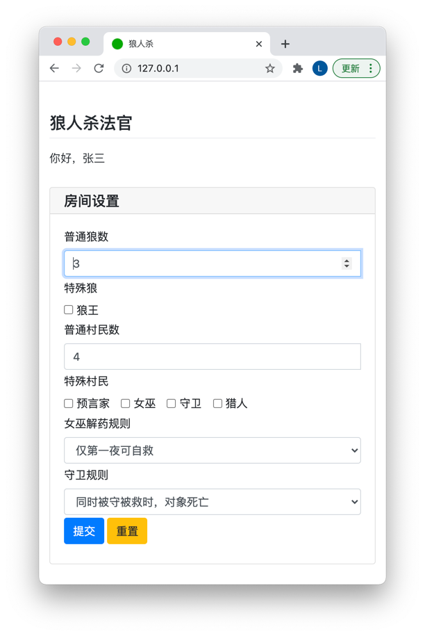

# Wolf
狼人杀面杀法官系统

Preview
--

如何使用
--
0. 安装 Python 3.7 版本及以上
1. pip install -r requirements.txt
2. python main.py
3. 所有玩家访问 Web 服务

TODO，欢迎PR
--
1. TTS 目前仅支持 macOS，windows，需要支持更多的平台
2. 多平台的 Standalone executable
3. 未对断线重连做支持 (等待 PyWebIO 支持)
4. 狼人自爆操作
   1. 在日间自杀，直接进入夜晚
5. 狼王技能
    1. 被猎人枪杀/日间投票出局可以带走一个人
    2. 被女巫毒害无法带人
6. 猎人技能
    1. 被狼人杀害/日间投票出局可以带走一个人
    2. 被女巫毒害无法带人